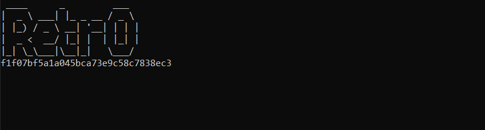

[**Latest Version**](https://github.com/Retr0680/Spotify-Player/releases)

## Installation ⚙️

1. Fork/Clone/Download this repo

    `git clone https://github.com/Retr0680/Spotify-Player.git`

2. Navigate to the directory

    `cd Spotify-Player

3. Install these Libraries before running the program
    
    - 📌 Pandas `pip install pandas`
    - 📌 speech_recognition `pip install SpeechRecognition`
    - 📌 spotipy `pip install spotipy`

4. Run the main.py script

    * `main.py`
    * `python3 main.py`

## Updating ⬇️

To update Discord-Bot with the stable release just pull the 
latest commit using Git.

Download the latest version: `git pull origin main`
